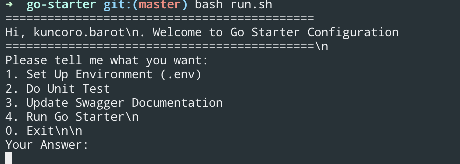

# Go Pawoon User

:bulb: Create a backend using GoLang for User Profile CRUD (UserID, Email, Name, Password) and Login Process (Username & Password) Process which follow SOLID Principles.

> Please read [how the app work section](###app-information) for overall flow or view this video below:

<a href="https://www.awesomescreenshot.com/video/4348716?key=92f7365360c36cd4aad5bbe5ebb4509f" target="_blank">  <p>Tutorial Run This Application</p> </a>

### App Information
This app use [gin](https://github.com/gin-gonic/gin) as a framework, [gorm](https://gorm.io/index.html) as an ORM and [go-swagger](https://github.com/go-swagger/go-swagger) as API documentation.

# :page_facing_up: Installation

1. Go installation: 
- Download: https://golang.org/dl/
- Instruction: https://golang.org/doc/install#install

2. You need to have database and set it later in .env:
```
Create your own form-generator database, lets call it `go-pawoon-user`
```

## Install Swagger Library
```bash
go get -u github.com/swaggo/swag/cmd/swag
```

## Seeder
```bash
go run database/seed.go
```

## Easy Setup & Run Go Pawoon User
For make it easier to do configuration in Go Pawoon User, I create shell script that you can use by type:
```bash
./run.sh
```

> If you need to run manual, please see [manual handling section](#wheelchair-manual-handling)



You need to use this step-by-step for running the app at the first time:
```go
1. Set Up Environment (.env) 
// Used for set-up app environment. For the first setup, you need to change your environment detail. For more information about environment that you need to add, please contact developer.

2. Do Unit Test 
// You can always running unit test by this feature

3. Update Swagger Documentation 
// You use swagger for maintain API restful documentation. You can check it later after running app (4. Run Go Pawoon User) and redirect to your app_link/swagger/index.html

4. Run Go Pawoon User 
// This feature is used for running the app
```

## API Documentation
> This feature only can be used after running the app
```bash
redirect to this link --> /swagger/index.html
```
e.g. http://localhost:3002/swagger/index.html


---

# :wheelchair: Manual Handling

## Set Environment
```bash
cp .env.example .env
```
> Fulfill your environment setup

## Unit Test
```
go test -coverprofile cp.out -v ./... && go tool cover -html=cp.out
```

## Update Swagger Documentation
```bash
swag init
```
or
```bash
{GOLANG_PATH}/go/bin/swag init 
//e.g. /Users/kuncoro.barot/go/bin/swag init
```

## Running App
```bash
go run main.go
```

